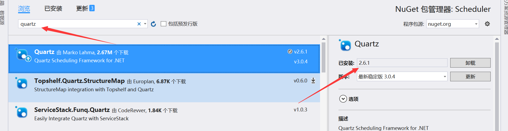

# Quartz.net


###  一、安装

项目用的是4.0的框架，所以nuget安装Quartz.net的时候 选择的是2.6版本的




### 二、调度器

```
using Quartz;

IScheduler scheduler;
//调度器工厂
ISchedulerFactory factory;


//实例化调度器，并且启动
//1、创建一个调度器
factory = new StdSchedulerFactory();
scheduler = factory.GetScheduler();
scheduler.Start();

```


### 三、job

所有任务必须继承**IJob** 接口，所以可以定义一个 JobBase类来继承 **IJob** 接口，然后具体的业务再去继承 jobBase类

```
 public abstract class JobBase: IJob
    {

        public delegate void MyCallBackFun();
        public string Name => throw new NotImplementedException();

        public void Execute(IJobExecutionContext context)
        {
            this.DoExecute(context);
        }

        public abstract void DoExecute(IJobExecutionContext context);

        public abstract IJobDetail GetJobDetail(IScheduler scheduler);

    }
```

基类定义成抽象，并且定义了**DoExecute** 跟 **GetJobDetail** 两个抽象方法，当子类所创建的job被调度器调用后，首先就会执行基类中Execute 方法，然后Execute 方法，再去调用具体子类的DoExecute方法

先看看子类的代码：

```
using System;
using System.Collections.Concurrent;
using System.Collections.Generic;
using System.Data;
using System.Linq;
using System.Reflection;
using System.Text;
using System.Threading;
using Quartz;

namespace Scheduler
{

    public class Class9 : JobBase
    {

        public string EntityName { get; set; }
        public string JobName { get; set; }
        public string JOB_ID { get; set; }

        public Class9()
        {
            EntityName = "Class9";
            JOB_ID = "3928";
        }

        public override IJobDetail GetJobDetail(IScheduler scheduler)
        {
        	IJobDetail job = JobBuilder.Create<Class9>().WithIdentity(new JobKey(JOB_ID)).SetJobData(jobDataMap).Build();
            return job;
        }

        public override void DoExecute(IJobExecutionContext context)
        {
            JobEntity.UpdateJobRunDate(JOB_ID);

            LogHelper.Log(string.Format("{0}执行:{1}", JOB_ID, DateTime.Now + Environment.NewLine));
        }
    }
}

```


然后在创建任务的地方：

```
private static  ConcurrentQueue<JobEntity> CalcTaskQueue = new  ConcurrentQueue<JobEntity>();

JobEntity obj = new JobEntity();
bool isOk = CalcTaskQueue.TryDequeue(out obj);
if (isOk)
{
	JobBase jobObj = (JobBase)Assembly.Load("Scheduler").CreateInstance("Scheduler." + 			obj.JobTypeEntity);

    var jobName = jobObj.GetType().FullName;
    //如果存在就先删除
    //scheduler.DeleteJob(new JobKey(jobName));

    //2、创建一个任务
    IJobDetail job = jobObj.GetJobDetail(scheduler);

    //3、创建一个触发器
    ITrigger trigger = TriggerBuilder.Create()
    .WithIdentity("trigger_" + obj.JobId, null)
    .WithCronSchedule("0/5 * * * * ?")
    .Build();

    //4、将任务与触发器添加到调度器中
    scheduler.ScheduleJob(job, trigger);
    //5、开始执行
	scheduler.Start();
}
```

 JobEntity类是数据库中job表的实体模型，其他都不重要，其中有一个属性 JobTypeEntity 很重要

```
public string JobTypeEntity
{
    get
    {
      EntityTypeMapping cv = new EntityTypeMapping();
      Type t = cv.GetType();
      var fileds = t.GetFields();

      var obj = fileds.Where(r => r.GetValue(cv).ToString() == this.JobType).FirstOrDefault();
      if (obj != null && string.IsNullOrEmpty(obj.Name) == false)
      {
      	return obj.Name;
      }
      throw new Exception("没有配置相关的类型");
	}
}
```

而 EntityTypeMapping 是一个假枚举类，为的是绑定 具体任务类(上面的 class9)跟数据库中任务类型的关系

```
public  class EntityTypeMapping
    {
        public const string Class11 = "11";

        public const string Class9 = "9";

        public const string Class32 = "32";
    }
```

东西准备好了，先来看看之前通过swich的做法来创建job， 大概的做饭是：

```
var type="9"；//具体是从数据库中读取出来的
swich(thpe)
	case"9":
		return JobBuilder.Create<Class9>().Build();
	case"11":
		return JobBuilder.Create<Class11>().Build();
	case"32":
		return JobBuilder.Create<Class32>().Build();
```


所有

这样不好维护，我想要的是一劳永逸！

用上面准备的东西，在创建job的时候只需要三句代码搞定

```
JobEntity obj = new JobEntity();
//从人物列表中取出一个任务
bool isOk = CalcTaskQueue.TryDequeue(out obj);
if(isOk)
{
	JobBase jobObj = (JobBase)Assembly.Load("Scheduler").CreateInstance("Scheduler." + 		obj.JobTypeEntity);
	IJobDetail job = jobObj.GetJobDetail(scheduler);
}
```

假设此时取出来的id=9的类（class9）,那么通过 EntityTypeMapping类，已经配置了

```
public const string Class9 = "9";
```

通过 JobTypeEntity 方法，可以获取到**obj.JobTypeEntity="class9"**

然后通过反射，就可以实例化Class9 这个类了

```
JobBase jobObj = (JobBase)Assembly.Load("Scheduler").CreateInstance("Scheduler." + 		obj.JobTypeEntity);
```

然后再class9类中的 GetJobDetail 方法就会 return出 以class9 为对象的 job实例

```
public override IJobDetail GetJobDetail(IScheduler scheduler)
{
   IJobDetail job = JobBuilder.Create<Class9>().WithIdentity(new JobKey(JOB_ID)).SetJobData(jobDataMap).Build();
            return job;
}
```

这样就行了！不管多少了任务实例，只要按照这个模式来写，创建任务的代码都不用改，只需要添加具体的任务类(class9、class11等等),然后在EntityTypeMapping类中按照规则维护好数据行了


### 四、创建触发器

```
ITrigger trigger = TriggerBuilder.Create()
  .WithIdentity("triggerid", "groupid")
  .WithCronSchedule("0/5 * * * * ?")//时间表达式
  .Build();

```

时间表达式非常巧妙，网上关于时间表达式的资料太多，这里就不写了


### 五、添加任务、触发器到调度器

```
scheduler.ScheduleJob(job, trigger);
                        //5、开始执行
scheduler.Start();
```


这样任务就完事了


### 六、添加触发器监听器

触发器监听器继承**ITriggerListener**接口

```
public class MyTriggerListener : ITriggerListener
    {
        private string name;

        public void TriggerComplete(ITrigger trigger, IJobExecutionContext context, SchedulerInstruction triggerInstructionCode)
        {
            LogHelper.Log(string.Format("{0}开始执行:{1}", ((Quartz.Impl.JobDetailImpl)context.JobDetail).Name, DateTime.Now + Environment.NewLine));
        }
        public void TriggerFired(ITrigger trigger, IJobExecutionContext context)
        {
            LogHelper.Log(string.Format("{0}job执行时调用:{1}", ((Quartz.Impl.JobDetailImpl)context.JobDetail).Name, DateTime.Now + Environment.NewLine));
        }
        public void TriggerMisfired(ITrigger trigger)
        {
            LogHelper.Log(string.Format("{0}错过触发时调用(例：线程不够用的情况下:{1}", ((Quartz.Impl.Triggers.AbstractTrigger)trigger).JobKey, DateTime.Now + Environment.NewLine));
        }
        public bool VetoJobExecution(ITrigger trigger, IJobExecutionContext context)
        {
            //Trigger触发后，job执行时调用本方法。true即否决，job后面不执行。
            return false;
        }
        public string Name { get { return name; } set { name = value; } }
    }
```

实例化 监听器：

```
 MyTriggerListener myTriggerListener = new MyTriggerListener();
 myTriggerListener.Name = "触发器监听";
```


在任务调度器启动之前 添加：

```
scheduler.ListenerManager.AddTriggerListener(myTriggerListener);
```

有了这个监听器，在触发器执行完成对应的任务后，就会去执行MyTriggerListener 类里面的方法，可以用来记录日志


### 八、任务监听器

任务监听器继承**IJobListener**接口

```
 public class MyJobListener : IJobListener
    {
        string name;
        public string Name { get { return name; } set { name = value; } }

        public void JobExecutionVetoed(IJobExecutionContext context)
        {
            
        }

        public void JobToBeExecuted(IJobExecutionContext context)
        {
            LogHelper.Log(string.Format("{0}开始执行:{1}", ((Quartz.Impl.JobDetailImpl)context.JobDetail).Name, DateTime.Now + Environment.NewLine));
        }

        public void JobWasExecuted(IJobExecutionContext context, JobExecutionException jobException)
        {
            LogHelper.Log(string.Format("{0}执行完毕:{1}", ((Quartz.Impl.JobDetailImpl)context.JobDetail).Name, DateTime.Now + Environment.NewLine));

            var fun = (Action<IScheduler>)((Quartz.Impl.JobDetailImpl)((Quartz.Impl.JobExecutionContextImpl)context).JobDetail).JobDataMap["successCallBackFun"];
            fun(context.Scheduler);
            

            //var jobId = ((Scheduler.Class11)((Quartz.Impl.JobExecutionContextImpl)context).JobInstance).JOB_ID;

        }
    }
```

用法跟 触发器监听器一样

```
MyJobListener myJobListener = new MyJobListener();
myJobListener.Name = "任务监听器";

scheduler.ListenerManager.AddJobListener(myJobListener);
```


### 九、指定时间内 执行job

在创建触发器(ITrigger)的时候 可以通过**StartAt**跟**EndAt**指定其开始与结束时间

```
 DateTime begTime = new DateTime(2018, 4, 24, 13, 43, 0);
 DateTime endTime = new DateTime(2019, 4, 24, 13, 43, 0);

//3、创建一个触发器
ITrigger trigger = TriggerBuilder.Create()
	.WithIdentity("trigger_" + obj.JobId, null).StartAt(begTime).EndAt(endTime)
	.WithCronSchedule("0/5 * * * * ?")
	.Build();
```

这样，哪怕是任务没有到执行执行的时间就被添加到了调度器里面去，也没关系，没有到开始执行时间，它是不会执行的


### 十、关于任务回调

开始是想着，某个任务执行完成后如果能有个回调函数直接执行的话，该多好。quartz里面是没有回调函数这个东西的（至少，我是没找到），多以的自己来写。首先相当的是委托。用构造函数把要执行的方法传给任务类(class9、class11之类的)。但是按照之前的做法在用反射创建jobBase类的时候，虽然是可以反射有参数的构造函数

```
 JobBase jobObj = (JobBase)Assembly.Load("Scheduler").CreateInstance("Scheduler." + obj.JobTypeEntity);
```

改成:

```
 Assembly assembly = Assembly.GetExecutingAssembly(); // 获取当前程序集 
  object[] parameters = new object[1];
 parameters[0] = obj.JobId.ToString();
 JobBase jobObj = (JobBase)assembly.CreateInstance("Scheduler."+ obj.JobTypeEntity, true, System.Reflection.BindingFlags.Default, null, parameters, null, null);// 创建类的实例

```

但是在GetJobDetail方法里面,默认调用的是无参的构造，其实调用哪个构造函数，都无所谓。因为这里已经是重新实例了一个对象，跟前面用构造函数创建的 对象不是同一个，所以传递过来的回调函数没用

```
IJobDetail job = JobBuilder.Create<Class9>().WithIdentity(new JobKey(JOB_ID)).SetJobData(jobDataMap).Build();
```

所以，这种方法行不通。找了好久总算是找到个好东西**JobDataMap**

原来每一个job都可以添加一组键值对形式存在的数据字典，所以在创建job的时候

```
  public override IJobDetail GetJobDetail(IScheduler scheduler)
        {
            Action<IScheduler> ac = new
                 Action<IScheduler>(TestCallFun);
            JobDataMap jobDataMap = new JobDataMap();
            KeyValuePair<string, object> kv = new KeyValuePair<string, object>("successCallBackFun", ac);
            jobDataMap.Add(kv);


            //var jobName = System.Reflection.MethodBase.GetCurrentMethod().DeclaringType.Name;
            IJobDetail job = JobBuilder.Create<Class9>().WithIdentity(new JobKey(JOB_ID)).SetJobData(jobDataMap).Build();
            return job;
        }
        
        
        public void TestCallFun(IScheduler scheduler)
        {
          //回调函数
        }
```


之前，添加了一个任务监听器，所以可以在任务执行完成后的方法里面来回调这个添加的方法

```
  //MyJobListener
  public void JobWasExecuted(IJobExecutionContext context, JobExecutionException jobException)
        {
            LogHelper.Log(string.Format("{0}执行完毕:{1}", ((Quartz.Impl.JobDetailImpl)context.JobDetail).Name, DateTime.Now + Environment.NewLine));

            var fun = (Action<IScheduler>)((Quartz.Impl.JobDetailImpl)((Quartz.Impl.JobExecutionContextImpl)context).JobDetail).JobDataMap["successCallBackFun"];
            fun(context.Scheduler);
            

            //var jobId = ((Scheduler.Class11)((Quartz.Impl.JobExecutionContextImpl)context).JobInstance).JOB_ID;

        }
```

好了，这样就可以解决问题了！


### 十一、设置线程数

```
Quartz.Simpl.SimpleThreadPool sp = new Quartz.Simpl.SimpleThreadPool();
sp.ThreadCount = 10;//设置10个线程
```


